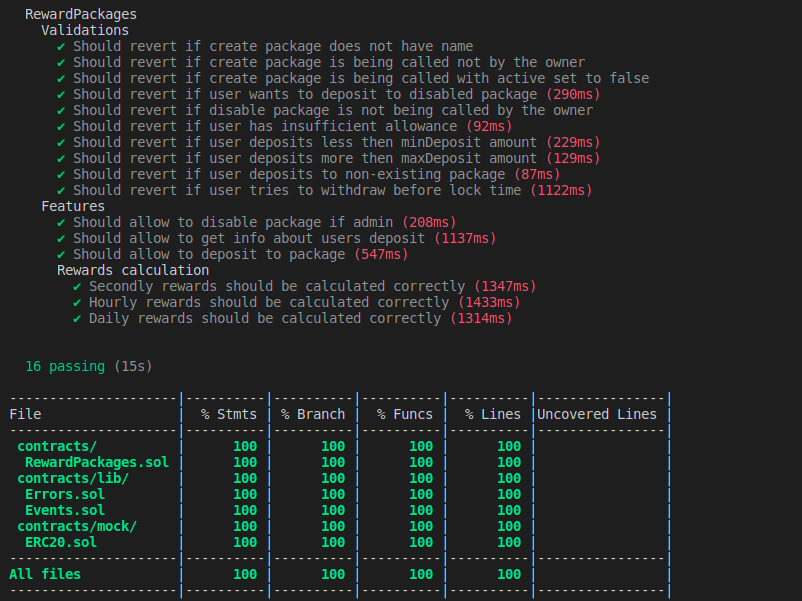

# Rewards Packages Project

This smart contract provides staking-like functionality for ERC20 tokens.

### Core functionalities:

- deposits
- withdrawals with rewards
- enabling staking per token (with desired package settings)
- disabling staking per token
- user deposit information

**IMPORTANT:** contract manages the payouts from others users deposits

### Code has coverage of 100%



#### install & compile & test

```shell
npm i
npx hardhat compile
npx hardhat test
```
